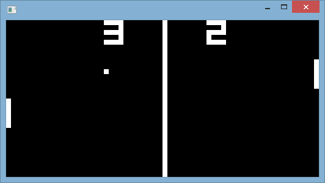

chip8-win-console
=================

For science!

Running
-------

1. Build the source
2. Run the program
3. Type in a path to a CHIP-8 game (relative to the exe)
4. Press Enter to play!

(This project relies on P/Invoke to interact with the native Windows API, and
thus only Windows Desktop platforms are supported at the moment)

Keyboard Input
--------------

A CHIP-8 / COSMAC-VIP keyboard is made up of 16 keys and is laid out like this:

    1 2 3 C
    4 5 6 D
    7 8 9 E
    A 0 B F

These are mapped to the following keys on a typical QWERTY keyboard:

    1 2 3 4
    Q W E R
    A S D F
    Z X C V

If you have a non-QWERTY keyboard that has the same mechanical layout, the keys
should map across to your setup equally well. For example, the keys for a
Russian ЙЦУКЕН keyboard *should* be mapped like so:

    1 2 3 4
    Й Ц У К
    Ф Ы В А
    Я Ч С М

TODOs / Up For Grabs
--------------------

* Implement a less flickery method of drawing to the console
  - Collision detection is done by inverting pixels on the screen, and it's
    quite evident...
* Less abrupt audio cut off
  - Sound is implemented by looping a dynamically-generated WAV file until a
    timer hits 0
  - Stopping the sound sometimes results in a little pop noise that's caused by
    the waveform dropping to 0 very suddenly, instead of smoothing out
* Configurable keyboard layout
* Get rid of some magic numbers / constants
* Support exiting / changing / resetting programs
